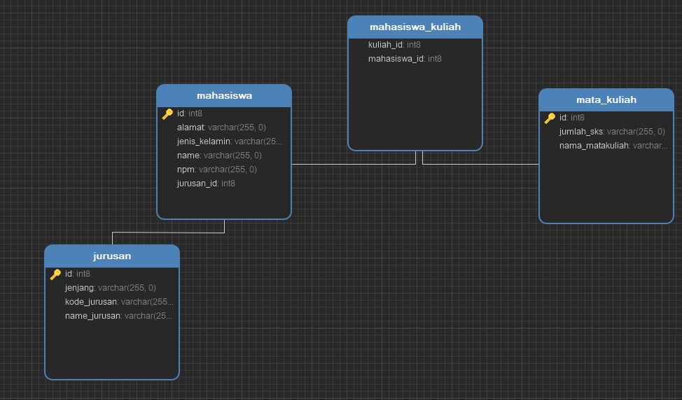

# **INFORMASI PROJEK**

> ## Projek Test Waizly

 

Bahasa Pemrograman: __*JAVA version 11.0.15*__

Framework : __*Quarkus version 2.15.1.Final*__

DBMS : __*POSTGRESQL*__

IDE : __*Visual Studio Code*__

> ## Dependencies
✬ quarkus-hibernate-orm-panache                      
✬ quarkus-hibernate-validator                        
✬ quarkus-jdbc-postgresql                            
✬ quarkus-resteasy-reactive                          
✬ quarkus-resteasy-reactive-jackson   
✬ quarkus-smallrye-openapi

> ## Entity 
   
- ### Jurusan, atribut: 
    - id
    - kodeJurusan *(wajib diisi)*
    - namaJurusan *(wajib diisi)*
    - jenjang
  
- ### Mahasiswa, atribut:
    - id
    - nama *(wajib diisi)*
    - jenisKelamin *(wajib diisi)*
    - alamat *(wajib diisi)*

- ### MataKuliah, atribut:
    - id
    - namaMataKuliah *(wajib diisi)*
    - sks *(wajib diisi)*

> ## Relasi Antar Entitas / Assocision
- Many To One : Mahasiswa -> Jurusan
- Many To Many : Mahasiswa -> MataKuliah
- One To Many : Dosen -> MataKuliah

> ## Format Response 
- Status true *(Boolean)*
- Pesan berhasil *(String)*
- Data yang dikembalikan *(Data)*

